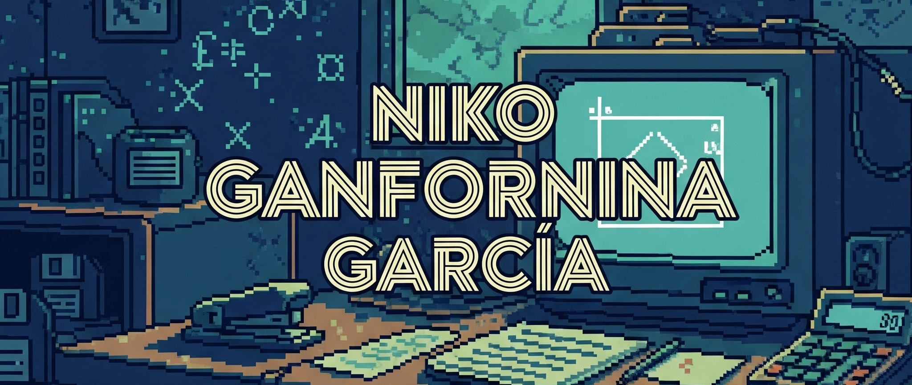

# ¡Hola! Soy Niko Ganfornina García 👋

## Bienvenid@ a mi repositorio 🎉

Soy un desarrollador apasionado por la tecnología, con especial interés en **Hibernate** y **JavaFX**. Me encanta aprender nuevas tecnologías y crear proyectos innovadores que resuelvan problemas reales. Estoy siempre en busca de desafíos que me permitan crecer profesionalmente.

## 💻 Mis Proyectos Destacados

### 1. **Helofy**
Un proyecto en desarrollo de un reproductor de música. Aún no está definido el entorno, pero su objetivo es ofrecer una experiencia única de reproducción musical, con funcionalidades innovadoras para los usuarios.

### 2. **Discerial**
Un juego de **trivial** con temática griega, creado con **JavaFX** para la interfaz gráfica y **Hibernate** para la persistencia de datos. El proyecto permite a los usuarios responder preguntas relacionadas con la mitología griega, poniendo a prueba su conocimiento de una forma divertida e interactiva.

## 🔧 Habilidades

- Adaptabilidad a cualquier entorno de trabajo.
- Trabajo en equipo y habilidades sociales bien desarrolladas.
- Alta capacidad de aprendizaje y compromiso.
- Creatividad y pensamiento crítico.
- Eficiencia en la resolución de problemas técnicos.

## 🛠️ Tecnologías y Herramientas

- **Java** (Especialmente **Hibernate** y **JavaFX**)
- **Python**
- **JSP**, **AJAX**
- **MySQL**, **MariaDB**, **HeidiSQL**
- **HTML**, **CSS**, **JavaScript**
- **Android Studio** (Desarrollo de aplicaciones móviles)
- **NetBeans**, **IntelliJ IDEA** (IDE principales para desarrollo Java)
- **Unity** (Desarrollo de juegos)

Mi tecnología favorita: **Hibernate** + **JavaFX** 🖥️✨

## 📞 Contacto

- 📧 **Gmail**: Nikoganfornina@gmail.com
- 📱 **Instagram**: [NikoGanfornina](https://www.instagram.com/NikoGanfornina)
- 💼 **LinkedIn**: [Niko Ganfornina](https://www.linkedin.com/in/niko-ganfornina)

---

¡Gracias por visitar mi perfil! 🚀
